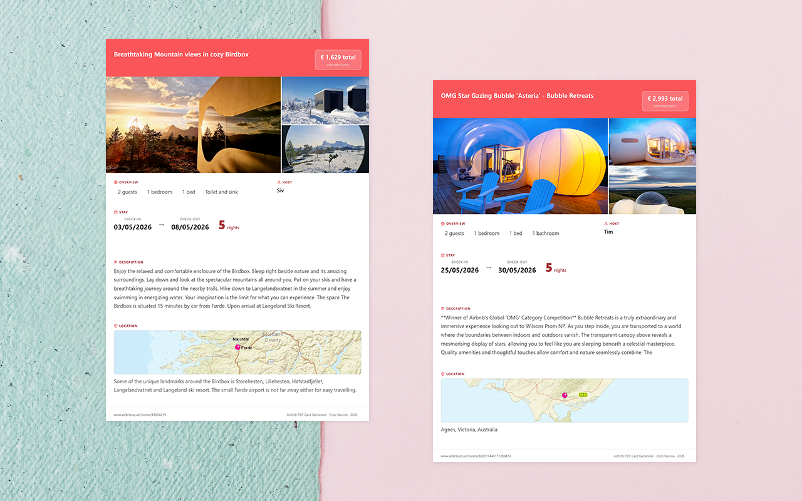

  

<h1 align="center">Airbnb PDF Card Generator</h1>

  <strong>Turn any Airbnb listing into a printable A4 card — one click, no nonsense</strong>

  
  

  <a href="#the-problem">The Problem</a> •
  <a href="#what-you-get">What You Get</a> •
  <a href="#install">Install</a> •
  <a href="#privacy">Privacy</a>

---

## The Problem

I was planning a family trip. I had evaluated 3 Airbnb listings.

My wife had already found 11.

We had so many Chrome tabs open that we kept losing track of which place was which — scrolling back and forth, comparing screenshots, sending links in the group chat.

Then I thought: what if I could print a simple card for each listing, throw them all on the table, and let everyone decide together?

So I built this.

---

## What You Get

Open any Airbnb listing. Click the extension icon. Get a clean A4 card ready to print or save as PDF.

Each card includes:

| | |
|---|---|
| 📍 Title & location | ⭐ Star rating & review count |
| 💰 Price & number of nights | 📅 Check-in / check-out dates |
| 🛏 Guests, bedrooms, beds, bathrooms | 👤 Host name |
| 📝 Full description | 🗺 Map with pin |
| 🖼 Up to 3 photos | |

Print them all. Spread them on the table. Pick your favourite.

---

## Install

Not on the Chrome Web Store yet. Install manually in ~30 seconds:

1. Download the latest `.zip` from the [Releases](../../releases) page
2. Unzip the file
3. Open Chrome → `chrome://extensions`
4. Enable **Developer mode** (top-right toggle)
5. Click **Load unpacked** → select the unzipped folder
6. Go to any Airbnb listing and click the extension icon

> Works on `airbnb.com`, `airbnb.it`, and all other regional Airbnb domains.

---

## Privacy

**No data ever leaves your browser.**

All listing data is saved locally (`chrome.storage.local`) and used only to populate the card. It's overwritten every time you generate a new card.

Map tiles are loaded from [ESRI ArcGIS](https://server.arcgisonline.com) — only the listing's coordinates are used, nothing else.

→ [Full privacy policy](https://www.enzobarone.it/extensions/airbnb-pdf-card-generator/privacy-policy.html)

---

## Permissions

| Permission | Why |
|---|---|
| `activeTab` | Read the Airbnb listing page when you click the icon |
| `scripting` | Inject the data-extraction script into the active tab |
| `storage` | Temporarily store extracted data to pass it to the print page |

---

## Credits

- House icon by [OpenMoji](https://openmoji.org) — CC BY-SA 4.0
- Map tiles by [ESRI ArcGIS](https://server.arcgisonline.com)

---

  Made by <a href="https://www.enzobarone.it">Enzo Barone</a>

